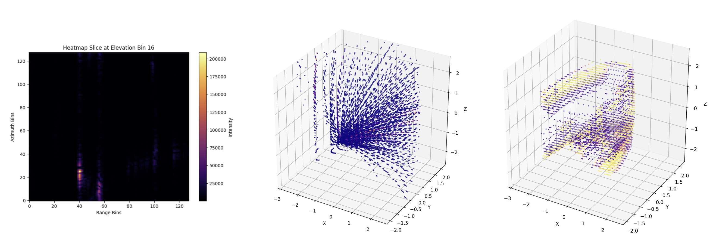
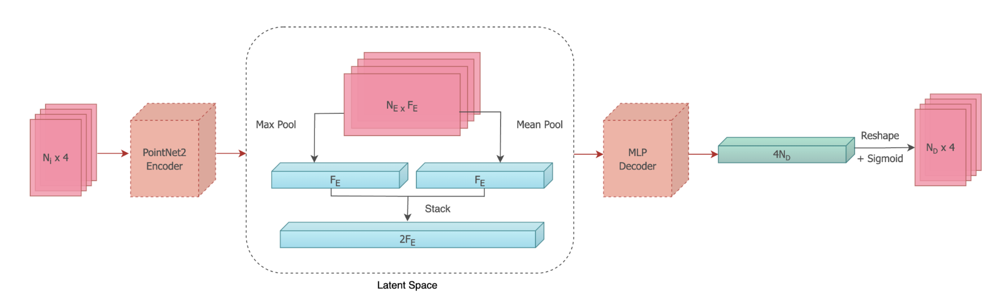
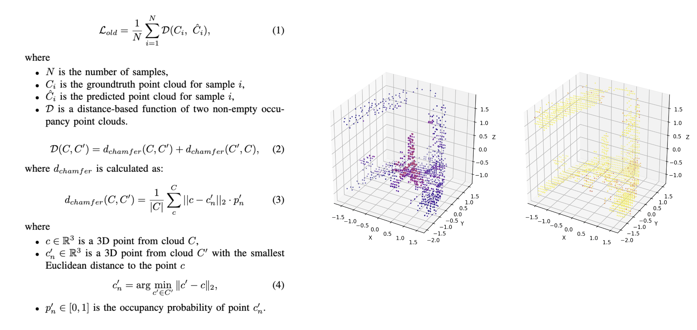
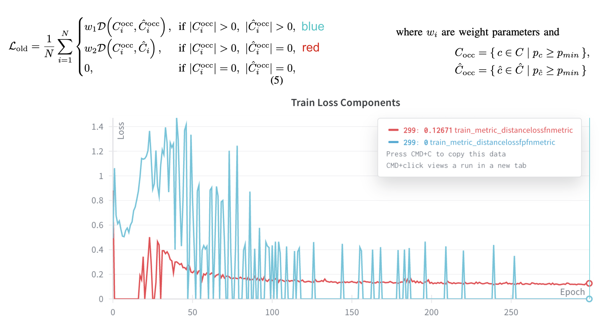
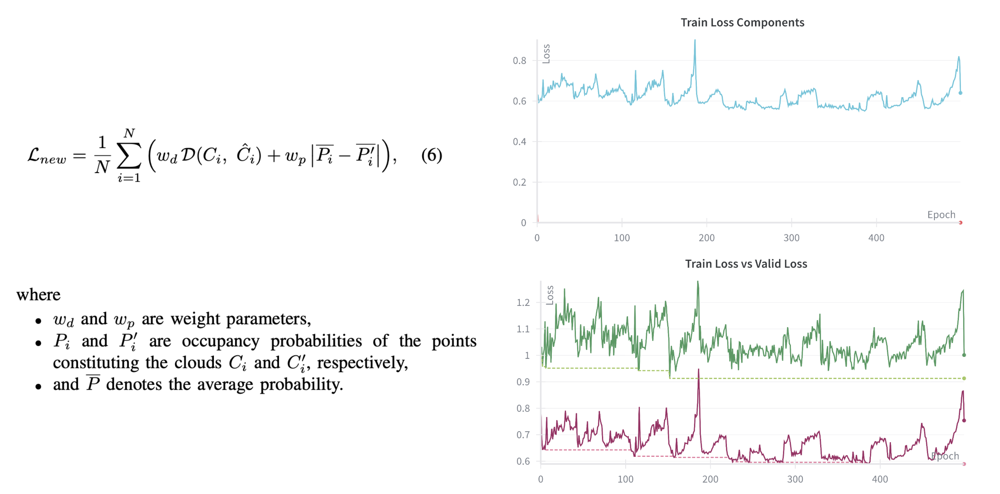

# 3D Occupancy Prediction from Dense Radar Images

This project focuses on predicting occupied space from dense 3D radar data. Millimeter-wave radar provides reliable sensing under challenging conditions, such as low visibility or adverse weather, where cameras and lidars are limited. While radar has been widely used for navigation and SLAM, the resolution and accuracy of currrent approaches remain significantly lower than those of lidar.

The objective of this project is to train a neural network to convert dense radar images into high-resolution occupancy predictions. This README outlines the dataset, model architecture, and loss functions used.

## Data

The dataset contains approximately `5000` samples.   Each sample consists of a **3D radar image** (or *heatmap*) paired with its corresponding **groundtruth lidar-like point cloud**. The radar images are represented as dense volumetric arrays, where each voxel is defined by polar coordinates `(azimuth, elevation, range)` and the corresponding `intensity` value of the radar return.

Before training, the radar images (**left figure**) are preprocessed as follows:
- Cropped to the field of view (FOV): `156.6°` azimuth `32.2°` elevation, and `7m` range.
- Transformed into Cartesian XYZI point clouds (**middle figure**).
- Filtered by an absolute intensity threshold of `5000` units.

The groundtruth point clouds (**right figure**) are sampled from a global octomap of the target scene using the corresponding radar poses and the same FOV. The log-odds occupancy values of each GT point are converted to `[0;1]` probability values prior to training.

## Model

The cloud-to-cloud transformation model follows a standard encoder-decoder architecture. The input point clouds are flattened into tensors, then encoded using PointNet2 abstractions into a 1D latent space. A simple MLP decoder reconstructs the predicted cloud from this latent space. 

## Loss

### 1. Chamfer Loss
The baseline loss function, `L_old`, optimizes for spatial similarity between point clouds. It computes the Chamfer distance between the predicted and groundtruth points, encouraging accurate prediction of XYZ coordinates. However, `L_old` does **not** penalize incorrect estimates of occupancy probabilities.  

In the example below, the **purple** cloud represents the prediction and the **yellow** cloud represents the ground truth. Color intensity corresponds to occupancy probability. Because the predicted probabilities are too low (below 0.5), the resulting cloud appears effectively “empty”.

### 2. Occupied-Only Loss
To encourage non-empty predictions, the loss can be restricted to consider only points classified as *occupied*. A point is considered occupied if its occupancy probability exceeds a defined threshold. The total loss is split into two components depending on whether the predicted cloud contains any occupied points.

In the figure below, the training curve shows how both loss components evolve:  
- **Blue**: the primary component (`L_old`) computed when both predicted and ground-truth clouds contain occupied points.  
- **Red**: the secondary component used when the predicted cloud contains no occupied points.

### 3. Chamfer-Occupancy Loss
To jointly learn both spatial structure and occupancy probabilities, the updated loss `L_new` introduces an additional occupancy term. It combines the Chamfer distance between predicted and true point clouds with the absolute difference of their average occupancy probabilities. This formulation enables the model to predict not only spatial coordinates `XYZ` but also occupancy probabilities `P` for each point.

